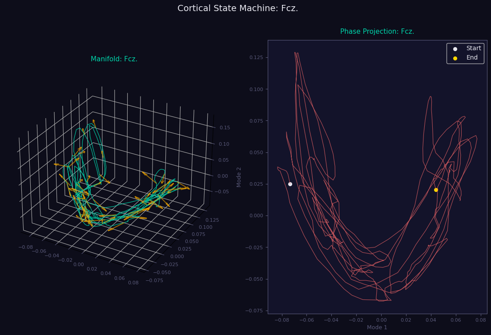
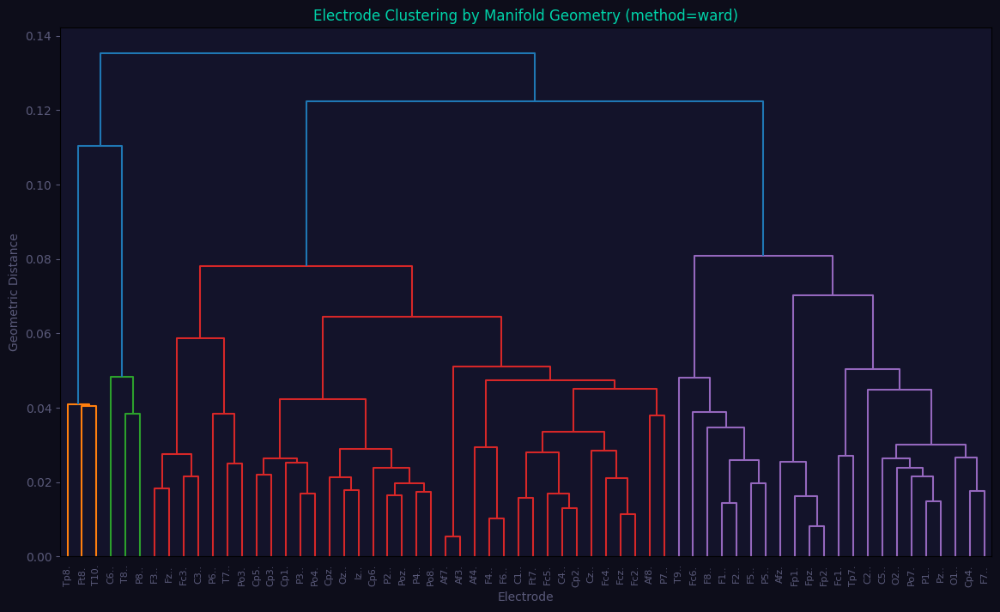

# GN-v18 Cortical State Bank Laboratory
### Multi-Electrode Laplace-Beltrami Manifold Analyzer & Causal State Emulator



**PerceptionLab Helsinki — 2026** *Theoretical Framework: Geometric Attractor Inversion Theory (GAIT)*

---

## Overview

**GN-v18 Cortical State Bank Laboratory** is a non-parametric, data-driven analytical workstation designed to extract, organize, and emulate the underlying physical geometry of human neural dynamics directly from multi-channel electroencephalogram (`.edf`) recordings. 

Unlike conventional deep learning architectures that map brainwaves using millions of arbitrary parameters and optimization weights via gradient descent, GN-v18 treats the cortex as an extended, dissipative physical medium. By combining **Takens’ Delay Embedding Theorem** with **Coifman & Lafon’s Diffusion Maps (2006)**, the laboratory unrolls 1D raw voltage traces into multi-dimensional phase space manifolds, computes their true **Laplace-Beltrami eigenmodes**, and maps out their local velocity structures (**Tangent Bundles**). 

The result is an objective mechanics simulator that tokenizes brain states into an explicit, searchable symbolic grammar, tracks structural phase-transitions in real time, and tests cognitive resilience using closed-loop causal emulations.

---

## Mathematical Foundations



The architecture operates entirely on un-fooled, rigid linear algebra and differential geometry divided into four main layers:

### 1. Attractor Reconstruction (Takens Delay Space)
A single scalar voltage channel $x(t)$ is mapped onto a multi-dimensional sensory sheet via a delay-coordinate embedding:

$$v(t) = \left[ x(t), x(t-\tau), x(t-2\tau), \dots, x(t-(d-1)\tau) \right] \in \mathbb{R}^d$$

Where $\tau$ is the delay spacing and $d$ is the embedding dimension. Takens’ theorem guarantees that if $d$ is sufficiently large, this mapping preserves the topological invariants of the true, unobserved multi-dimensional cortical attractor $\mathcal{M}$.

### 2. Laplace-Beltrami Eigenmode Extraction
To extract the natural geometric resonances of the data manifold without hardcoding a coordinate system, the system constructs a localized graph similarity matrix $K$ using a Gaussian kernel on the point cloud of delay vectors:

$$K_{ij} = \exp\left(-\frac{\|v_i - v_j\|^2}{\epsilon}\right)$$

Where $\epsilon$ is the kernel bandwidth parameter. To isolate the intrinsic geometry from non-uniform sampling densities, we normalize by the degree matrix $D_{ii} = \sum_j K_{ij}$ to construct the normalized, symmetric Graph Laplacian:

$$L_{\text{sym}} = I - D^{-1/2} K D^{-1/2}$$

The lowest non-trivial eigenvectors of $L_{\text{sym}}$ solve the continuous Laplace-Beltrami operator equation $\Delta_{\mathcal{M}} \phi = \lambda \phi$ over the data surface. These eigenvectors act as the true "spectral neurons" of the system—each one representing an orthogonal, standing wave component of the underlying mental attractor.

### 3. Tangent Bundle Estimation ($TM$)
To calculate the active rules of motion steering the brain state forward, the engine builds local coordinate charts at every point $p$ on the 3D manifold. For each point, it computes a Singular Value Decomposition (SVD) on a localized window of its $k$-nearest chronological neighbors:

$$X_{\text{local}} = U \Sigma V^\top$$

The principal right singular vector (the first column of $V$) defines the orientation of the flat **tangent plane** kissing the manifold at that exact coordinate. This tangent vector field represents the instantaneous phase velocity ($\dot{x} \in T_p\mathcal{M}$) and the deterministic constraints governing where the system is physically permitted to track next.

### 4. Structural Curvature (Tension Metric)
The ratio of the secondary singular value to the primary singular value measures the local geometric frustration or turning strain:

$$\kappa = \frac{S_1}{S_0}$$

* **Low Curvature ($\kappa \to 0$):** High lamination. The trajectory follows a highly determined, regular, and predictable pathway.
* **High Curvature ($\kappa \to 1$):** Local dimension expansion. The trajectory hits a sharp geometric corner or a phase boundary, forcing the manifold to flatten out locally as the brain state splits or transitions into an entirely different attractor basin.

---

## Architectural Layout & Capabilities

The GN-v18 workspace is organized into a modular, dashboard-driven environment:

```Bash
                      ┌──────────────────────────┐
                      │     Multi-Channel EDF    │
                      └─────────────┬────────────┘
                                    │
                                    ▼
                      ┌──────────────────────────┐
                      │  Laplace-Beltrami Engine │
                      └─────────────┬────────────┘
                                    │
        ┌───────────────────────────┼───────────────────────────┐
                                                              
┌───────────────────────┐   ┌───────────────────────┐   ┌───────────────────────┐
│   Manifold Browser    │   │  Dynamic Connectome   │   │ Causal State Emulator │
├───────────────────────┤   ├───────────────────────┤   ├───────────────────────┤
│ Visuallizes the 3D    │   │ Calculates functional │   │ Injects thermodynamic │
│ attractor structures  │   │ alignment distances   │   │ vector shocks to test │
│ & tangent fields per  │   │ & clusters brain      │   │ Lyapunov basin        │
│ electrode node.       │   │ regions via linkage.  │   │ recovery vs mutation. │
└───────────────────────┘   └───────────────────────┘   └───────────────────────┘
```

### Tab 1: Manifold Browser & State Bank
* **Electrode Saccading:** Instantly switch between any electrode target captured in the EDF record (e.g., `Fp1`, `O2`, `C3`) to inspect its native geometric morphology.
* **Crystalline Quantization:** Tune the kernel bandwidth ($\epsilon$), embedding depth ($d$), and window size ($k$) tightly to compress smooth, analog "frayed ribbons" into discrete, blocky state blocks. 
* **Symbolic Change-point Profiling:** Automatically reads the connection matrix $K$ and outputs an explicit assembly trace marking when the system locks into a state block (`LOOP_CYC`, `HOLD_REG`) and when it executes a conditional jump (`TRANSITION_SLIP`).

### Tab 2: Inter-Electrode Analytics & Connectomics
* **Manifold Proximity Metric:** Computes a full cross-electrode distance matrix by evaluating the structural alignment of the underlying manifolds across different brain regions.
* **Hierarchical Clustering:** Feeds the distance matrix into an agglomerative hierarchical linkage algorithm, plotting a living **Dendrogram** that groups electrode nodes into active functional networks based on geometric isomorphism rather than raw correlation.

### Tab 3: Closed-Loop Counterfactual Emulation
* **Generative Flow Integration:** Freezes the compiled tangent fields and executes them as an active, predictive open-loop script, letting a virtual seed point navigate the manifold autonomously.
* **Thermodynamic Shocks:** Injects user-defined vector perturbations into the running simulation at precise timestamps.
* **Resilience Profiling:** Measures the system's response to shocks. If the error distance decays exponentially to zero, the basin is classified as `STABLE_RECOVERY`. If the shock forces the path over a separatrix line into an adjacent attractor gutter, the console flags a permanent state toggle: `DEVIATED/MUTATED`.

### Tab 4: Non-Volatile Engram Consolidation
* **State Hydration:** When a permanent mutation settles on an alternative stable basin (e.g., establishing a 0.1103 residual error floor), clicking the memory commit tool executes a geometric merge. It recalculates the SVD tangent fields along the mutated track and exports a standalone `.npz` archive.
* **Re-Hydration:** Reloading this `.npz` archive back into the emulator gateway re-hydrates the system directly inside the mutated basin, demonstrating true multi-stable memory persistence with zero retraining loops.

---

## Quick Start & Dependencies

### Prerequisites
Ensure your Python environment has the following packages installed:
```bash
pip install numpy scipy matplotlib gradio mne soundfile
```

# Execution

Save the engine file as cortical_emulator2.py and run it from your document house directory:

```Bash
python3 cortical_emulator2.py
```

Open your local web browser and navigate to the port indicated in the terminal (default is http://localhost:7860).

# Operating Parameter

| Parameter | Operational Domain | Lower Settings Impact (↓) | Higher Settings Impact (↑) |
| :--- | :--- | :--- | :--- |
| **$\tau$ (Delay Spacing)** | Attractor Unrolling | Hyper-localized, high collinearity; reveals sharp "CPU-like" logical grids. | Expanded macro-scale trajectory loops; exposes fluid, continuous geometries. |
| **$d$ (Embedding Depth)** | State Dimensionality | Fast, simplified geometric projections; reduces computational complexity. | Deep temporal tracking; uncovers nested trajectories and complex limit-cycles. |
| **$\epsilon$ (Kernel Bandwidth)** | Manifold Affinity Graph | Breaks long-range connections; quantizes the affinity matrix into hard block gates. | Smooths out boundaries; creates homogenous global diffusion fields across states. |
| **$k$-Neighbors (SVD Window)** | Tangent Space Resolution | Evaluates velocity from tight, point-to-point steps; highly sensitive to phase shifts. | Averages out local micro-jitters to expose the global macro-highway of the rhythm. |
